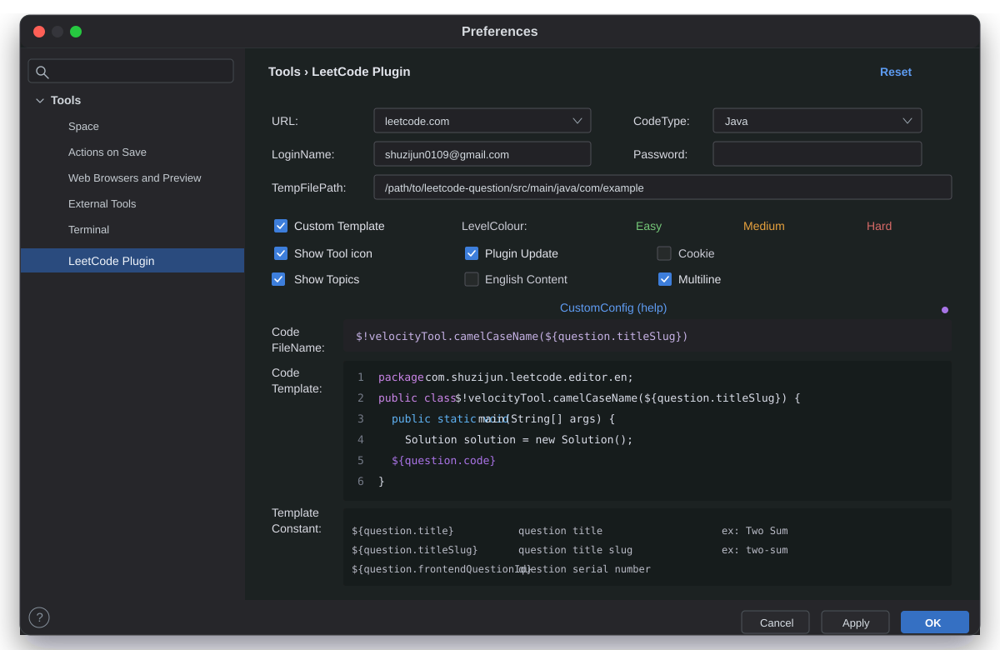

# [![Leetcode Editor][plugin-logo]][gh:leetcode-editor] Leetcode Editor 

[![Release][badge:release]][gh:releases]
[![Snapshot][badge:snapshot]][gh:snapshot]
[![License][badge:license]][gh:license]
[![Plugin Homepage][badge:plugin-homepage]][plugin-homepage]
[![Version][badge:version]][plugin-versions]
[![Pro Plugin Homepage][badge:plugin-homepage-pro]][plugin-homepage-pro]
[![Version][badge:pro-version]][plugin-versions-pro]
[![Downloads][badge:downloads]][plugin-homepage]
[![English Document][badge:en-doc]][gh:en-doc]
[![中文文档][badge:zh-doc]][gh:zh-doc]
[![捐赠][badge:donate]][shuzijun-donate]
[![内推][badge:referrals]][shuzijun-referrals]  

---

## 简介

无需离开 IDE 即可完成 LeetCode 刷题。插件支持 `leetcode.com` 与
`leetcode.cn`，覆盖题目浏览、本地调试和提交等常用流程。

理论上支持 **IntelliJ IDEA**、**PhpStorm**、**WebStorm**、**PyCharm**、
**RubyMine**、**AppCode**、**CLion**、**GoLand**、**DataGrip**、**Rider**、
**MPS** 和 **Android Studio** 等 JetBrains IDE。

- [English documentation][gh:en-doc]
- [中文文档][gh:zh-doc]
- [登录帮助][gh:login-help]
- [自定义代码生成][gh:custom-code-zh]（[示例][gh:leetcode-question]）
- 更多开放能力：[shuzijun/lc-sdk](https://github.com/shuzijun/lc-sdk)

## 开始使用

 

## 本地调试  

### 安装（[帮助][managing-plugins]）

- 从 [JetBrains 插件市场][plugin-homepage] 安装。
- 从 [GitHub Releases][gh:releases] 下载并安装。
- 可通过 [LeetCode Editor Pro][plugin-homepage-pro] 支持项目。

### 配置

- **路径：**`File` → `Settings` → `Tools` → `LeetCode Plugin`
- **`URL 可选项`：**选择 `leetcode.com` 或 `leetcode.cn`。
- **`Code Type`：**Java、Python、C++、Python 3、C、C#、JavaScript、Ruby、Swift、Go、Scala、Kotlin、Rust、PHP、Bash 或 SQL。
- **`LoginName` / `Password`：**当前网站的登录凭据。
- **`Temp File Path`：**生成临时文件的存放目录。
- **`proxy (HTTP Proxy)`：**在 `File` → `Settings` → `Appearance & Behavior` → `System Settings` → `HTTP Proxy` 中配置。
- **`Custom code template`：**自定义代码生成模板（[详细介绍][gh:custom-code-zh]、[示例][gh:leetcode-question]）。
- **`LevelColour`：**自定义题目难度颜色；修改后需重启 IDE 生效。
- **`English Content`：**以英文显示题目描述。
  
### 题目导航窗口

  
- **工具栏**
  - ![login][icon:login] **登录：**为当前网站配置账号；两个网站的账号互不共享。
  - ![logout][icon:logout] **退出：**退出当前账号；登录异常时可先尝试退出。
  - ![refresh][icon:refresh] **刷新：**未登录也可以加载题目，但提交仍需登录。
  - ![pick][icon:pick] **随机：**随机打开一个题目。
  - ![find][icon:find] **查找：**打开搜索、筛选和排序面板。
  - ![progress][icon:progress] **会话：**查看或切换会话。
  - ![toggle][icon:toggle] **切换列表：**切换“所有题目列表”“分页题目列表”和“CodeTop 题目列表”。
  - ![config][icon:config] **配置：**快捷打开配置页面。
  - ![clear][icon:clear] **清理：**清理当前网站配置的缓存目录。未提交题目时请谨慎操作。

### 右键菜单

   

- **题目菜单：**在题目上右击可使用以下操作：
  - **Open question：**打开题目；双击题目也可打开。
  - **Open content：**查看题目描述和图片（依赖 Markdown）。
  - **Open solution：**查看题解。
  - **Open in web：**在浏览器中打开题目。
  - **Submit：**提交当前解答。
  - **Submissions：**查看提交记录，并在弹窗中通过 **Show detail** 查看详情。
  - **Run Code：**使用题目默认测试用例运行代码。
  - **Testcase：**自定义测试用例。
  - **Favorite：**添加或移除收藏。
  - **Note：**打开题目笔记。
  - **Timer：**在状态栏记录解题时间。
  - **Clear cache：**清理当前题目的缓存文件。
- **Editor 菜单：**在编辑器中右击可使用相同功能。
- **问题编辑器页签：** **Content** 查看题目描述和图片，**Solution** 查看题解，**Submissions** 查看提交记录，**Note** 查看笔记。
  
### 常见问题  
  [常见问题][gh:question] 

### 支持

- [捐赠][shuzijun-donate]

[plugin-logo]: https://cdn.jsdelivr.net/gh/shuzijun/leetcode-editor@master/src/main/resources/META-INF/pluginIcon.svg

[badge:plugin-homepage]: https://img.shields.io/badge/Plugin%20Home-Leetcode%20Editor-blue?logo=jetbrains&style=flat-square
[badge:plugin-homepage-pro]: https://img.shields.io/badge/Pro%20Plugin%20Home-Leetcode%20Editor%20Pro-blue?logo=jetbrains&style=flat-square&color=blueviolet
[badge:release]: https://img.shields.io/github/actions/workflow/status/shuzijun/leetcode-editor/release.yml?branch=master&style=flat-square&logo=github&&label=Release%20Build
[badge:snapshot]: https://img.shields.io/github/actions/workflow/status/shuzijun/leetcode-editor/snapshot.yml?branch=master&style=flat-square&logo=github&&label=Snapshot%20Build
[badge:license]: https://img.shields.io/github/license/shuzijun/leetcode-editor.svg?style=flat-square&&label=License
[badge:downloads]: https://img.shields.io/jetbrains/plugin/d/12132?style=flat-square&label=Plugin%20Downloads&logo=jetbrains
[badge:version]: https://img.shields.io/jetbrains/plugin/v/12132?label=Plugin%20Version&logo=jetbrains&style=flat-square
[badge:pro-version]: https://img.shields.io/jetbrains/plugin/v/17166?label=Pro%20Plugin%20Version&logo=jetbrains&style=flat-square&color=blueviolet
[badge:en-doc]: https://img.shields.io/badge/Docs-English%20Document-blue?logo=docs&style=flat-square
[badge:zh-doc]: https://img.shields.io/badge/Docs-中文文档-blue?logo=docs&style=flat-square
[badge:donate]: https://img.shields.io/badge/Docs-捐赠-ff69c4?logo=docs&style=flat-square
[badge:referrals]: https://img.shields.io/badge/Docs-内推-ff69c4?logo=docs&style=flat-square

[icon:leetcode]: https://cdn.jsdelivr.net/gh/shuzijun/leetcode-editor@master/src/main/resources/icons/LeetCode_dark.svg
[icon:login]: https://cdn.jsdelivr.net/gh/shuzijun/leetcode-editor@master/src/main/resources/icons/login_dark.svg
[icon:logout]: https://cdn.jsdelivr.net/gh/shuzijun/leetcode-editor@master/src/main/resources/icons/logout_dark.svg
[icon:refresh]: https://cdn.jsdelivr.net/gh/shuzijun/leetcode-editor@master/src/main/resources/icons/refresh_dark.svg
[icon:pick]: https://cdn.jsdelivr.net/gh/shuzijun/leetcode-editor@master/src/main/resources/icons/random_dark.svg
[icon:find]: https://cdn.jsdelivr.net/gh/shuzijun/leetcode-editor@master/src/main/resources/icons/find_dark.svg
[icon:progress]: https://cdn.jsdelivr.net/gh/shuzijun/leetcode-editor@master/src/main/resources/icons/progress_dark.svg
[icon:toggle]: https://cdn.jsdelivr.net/gh/shuzijun/leetcode-editor@master/src/main/resources/icons/toggle_dark.svg
[icon:config]: https://cdn.jsdelivr.net/gh/shuzijun/leetcode-editor@master/src/main/resources/icons/config_lc_dark.svg
[icon:clear]: https://cdn.jsdelivr.net/gh/shuzijun/leetcode-editor@master/src/main/resources/icons/clear_dark.svg

[gh:leetcode-editor]: https://github.com/shuzijun/leetcode-editor
[gh:releases]: https://github.com/shuzijun/leetcode-editor/releases
[gh:snapshot]: https://github.com/shuzijun/leetcode-editor/actions?query=workflow%3ASnapshot
[gh:license]: https://github.com/shuzijun/leetcode-editor/blob/master/LICENSE
[gh:en-doc]: https://github.com/shuzijun/leetcode-editor/blob/master/README.md
[gh:zh-doc]: #简介
[gh:login-help]: https://github.com/shuzijun/leetcode-editor/blob/master/doc/LoginHelp_ZH.md
[gh:custom-code-zh]: https://github.com/shuzijun/leetcode-editor/blob/master/doc/CustomCode_ZH.md
[gh:leetcode-question]: https://github.com/shuzijun/leetcode-question
[gh:question]: https://github.com/shuzijun/leetcode-editor/wiki/%E5%B8%B8%E8%A7%81%E9%97%AE%E9%A2%98

[plugin-homepage]: https://plugins.jetbrains.com/plugin/12132-leetcode-editor
[plugin-versions]: https://plugins.jetbrains.com/plugin/12132-leetcode-editor/versions
[plugin-homepage-pro]: https://plugins.jetbrains.com/plugin/17166-leetcode-editor-pro
[plugin-versions-pro]: https://plugins.jetbrains.com/plugin/17166-leetcode-editor-pro/versions
[managing-plugins]: https://www.jetbrains.com/help/idea/managing-plugins.html

[shuzijun-donate]: https://shuzijun.cn/donate.html
[shuzijun-referrals]: https://shuzijun.cn/referrals.html
